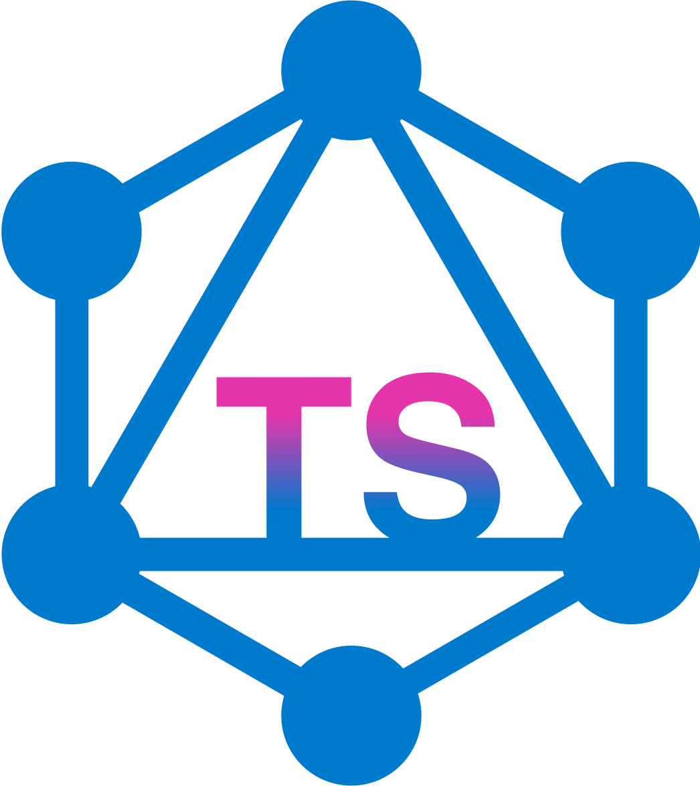

# Simple-graphql-to-typescript generator

🚀 🔄 Simple Typescript interface generator from a GraphQL api schemas or URL

<p align="center">
  <a href='https://sgts.netlify.com/'>
    
  </a>
</p>

[![npm version][npm-version-src]][npm-version-href]
[![npm downloads][npm-downloads-src]][npm-downloads-href]
[![npm downloads][npm-total-downloads-src]][npm-downloads-href]


[npm-version-src]: https://img.shields.io/npm/v/simple-graphql-to-typescript.svg
[npm-version-href]: https://www.npmjs.com/package/simple-graphql-to-typescript
[npm-downloads-src]: https://img.shields.io/npm/dm/simple-graphql-to-typescript.svg
[npm-total-downloads-src]: https://img.shields.io/npm/dt/simple-graphql-to-typescript.svg
[npm-downloads-href]: https://www.npmjs.com/package/simple-graphql-to-typescript

### Any help for writing test or adding options is greatly welcomed! 😁

## Usage

Refer to the full [documentation](https://sgts.netlify.com) !

## New in 0.10.12

Added `apolloVersion` option.

## **Installation**

For global use

```bash
npm i -g simple-graphql-to-typescript
#or
yarn global add simple-graphql-to-typescript
```

For local use

```bash
npm i simple-graphql-to-typescript --save-dev
#or
yarn add -D simple-graphql-to-typescript
```

## Quick Exemples

### With generated, fully-typed and abortable Apollo handlers, and generated fragments

```bash
sgts -e https://graphql.anilist.co/ -o ./generated.ts --codegen-functions --gen-fragments
```

```typescript
import { apiProvider } from './generated.ts';
import { ApolloClient } from '@apollo/client/core';

const sgts = apiProvider(
  new ApolloClient({ uri: 'https://graphql.anilist.co/', cache: new InMemoryCache() })
);
// Declare the main api source with your ApolloClient constructor

const mediaListQuery = sgts.MediaList().$args({ sort: [MediaListSort.Added_time] });

// You can still add fallback fragment by passing it to the first method
// `sgts.MediaList(`id status`)...`
// Or
// `sgts.MediaList(gql`fragment MediaListFragment on MediaList { ... }`)...`

const mediaList = await mediaListQuery.$fetch();
console.log(mediaList);

mediaListQuery.$abort();
// You can abort the query anytime
```

### With only GraphQL types transpiled to Typescript interfaces

```bash
sgts -e https://graphql.anilist.co/ -o ./generated.ts
```

Part of the generated output:

```typescript
...

/** A user's general options */
export interface UserOptions {
  /** The language the user wants to see media titles in*/
  titleLanguage: Maybe<UserTitleLanguage>;
  /** Whether the user has enabled viewing of 18+ content*/
  displayAdultContent: Maybe<boolean>;
  /** Whether the user receives notifications when a show they are watching aires*/
  airingNotifications: Maybe<boolean>;
  /** Profile highlight color (blue, purple, pink, orange, red, green, gray)*/
  profileColor: Maybe<string>;
  /** Notification options*/
  notificationOptions: Maybe<NotificationOption[]>;
  /** The user's timezone offset (Auth user only)*/
  timezone: Maybe<string>;
  /** Minutes between activity for them to be merged together. 0 is Never, Above 2 weeks (20160 mins) is Always.*/
  activityMergeTime: Maybe<number>;
}

/** The language the user wants to see media titles in */
export enum UserTitleLanguage {
  Romaji = 'ROMAJI',
  English = 'ENGLISH',
  Native = 'NATIVE',
  Romaji_stylised = 'ROMAJI_STYLISED',
  English_stylised = 'ENGLISH_STYLISED',
  Native_stylised = 'NATIVE_STYLISED',
}
...
```

## Help

```bash
sgts -h
```

## **Options**

| Option                      | Short syntax | Type                                         | Usage                                                                |
| --------------------------- | ------------ | -------------------------------------------- | -------------------------------------------------------------------- |
| --endpoint `<endpoint>`     | -e           | string(url)                                  | [See doc](https://sgts.netlify.com/options/endpoint.html)            |
| --json `<path to json>`     | -j           | string(path)                                 | [See doc](https://sgts.netlify.com/options/json.html)                |
| --output `<path>`           | -o           | string(path) <br> _default_ `./generated.ts` | [See doc](https://sgts.netlify.com/options/output.html)              |
| --codegen-functions         |              | boolean                                      | [See doc](https://sgts.netlify.com/options/codegen-functions.html)   |
| --codegen-react-hooks       |              | boolean                                      | [See doc](https://sgts.netlify.com/options/codegen-react-hooks.html) |
| --codegen-vue-hooks         |              | boolean                                      | [See doc](https://sgts.netlify.com/options/codegen-vue-hooks.html)   |
| --gen-fragments             |              | boolean                                      | [See doc](https://sgts.netlify.com/options/gen-fragments.html)       |
| --codegen-templates         |              | boolean                                      | [See doc](https://sgts.netlify.com/options/withGqlQueries.html)      |
| --apolloVersion             |              | number <br> _default_ `3`                    | [See doc](https://sgts.netlify.com/options/apolloVersion.html)       |
| --customScalars `<scalars>` |              | {"myScalar": "MyType"}                       | [See doc](https://sgts.netlify.com/options/customScalars.html)       |
| --prefix `<prefix>`         | -p           | string <br> _default_ `null`                 | [See doc](https://sgts.netlify.com/options/prefix.html)              |
| --suffix `<suffix>`         | -s           | string <br> _default_ `null`                 | [See doc](https://sgts.netlify.com/options/suffix.html)              |
| --header `<header>`         |              | string <br> _default_ `null`                 | [See doc](https://sgts.netlify.com/options/header.html)              |
| --compileToJs               |              | boolean                                      | [See doc](https://sgts.netlify.com/options/jsMode.html)              |
| --download                  | -D           | string <br> _default_ `null`                 | [See doc](https://sgts.netlify.com/options/download.html)            |
| generate                    |              | string <br> _default_ `development`          | [See doc](https://sgts.netlify.com/options/config.html)              |
| init                        |              |                                              | [See doc](https://sgts.netlify.com/options/init.html)                |

## Roadmap

I don't have much free time to develop feature I don't use, but feel free to send a PR!

- [x] Export only Gql string
- [x] Removed Query and mutation name in Apollo Hooks data
- [x] Config file `.sgtsrc.js`
- [x] Support Subscriptions for codegen-react-hooks
- [x] Support Subscriptions for codegen-vue-hooks
- [x] Support Subscriptions for codegen-template
- [ ] Support Subscriptions for codegen-functions
- [ ] Support UseLazyQuery Apollo Hook

**In Progress**

- [ ] Highlight new generated, modified or deleted types in terminal

# License

MIT

Victor Garcia
